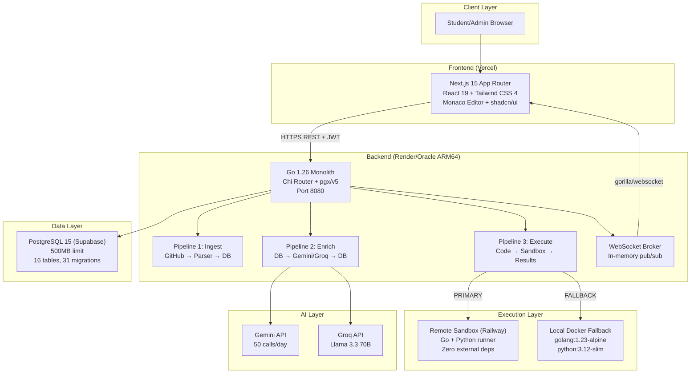
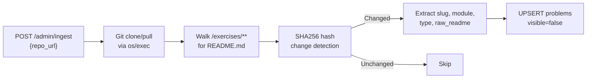
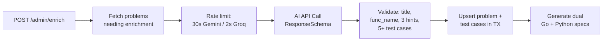
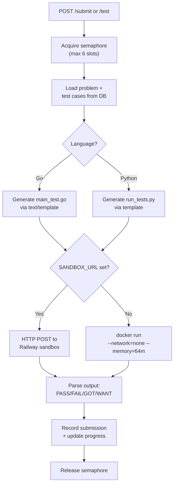
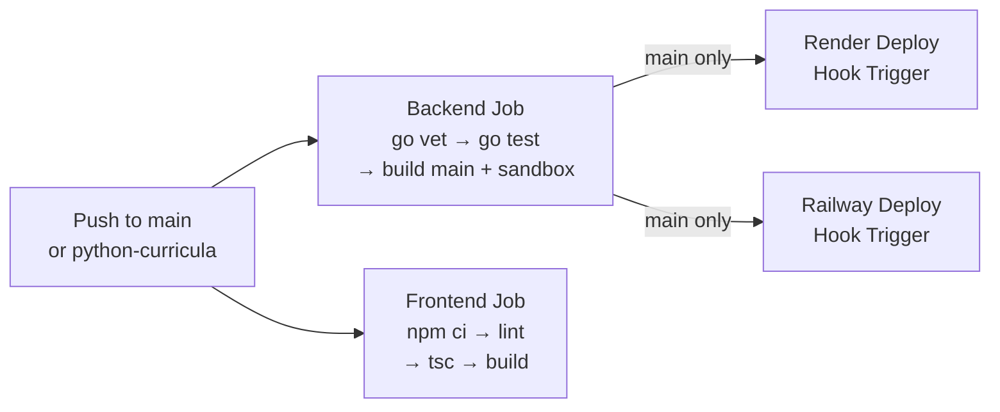

# Koder — Professional Codebase Index

> Comprehensive analysis of the zero-cost, production-grade automated code-grading platform.

---

## 1. Project Identity

| Field | Value |
|---|---|
| **Name** | Koder |
| **Purpose** | Automated code-grading platform for Go & Python programming curricula |
| **Repository** | `github.com/jerryjuche/koder` |
| **License** | MIT |
| **Go Module** | `github.com/jerryjuche/koder` (Go 1.26.1) |
| **Active Branch** | `python-curricula` (all 12 multi-language phases complete) |
| **Test Suite** | 123 tests, 0 failures, `go vet` clean |
| **Last Updated** | 2026-07-09 |

---

## 2. Architecture Overview

### 2.1 System Topology



### 2.2 Technology Stack

| Layer | Technology | Version | Purpose |
|---|---|---|---|
| **Backend Runtime** | Go | 1.26.1 | HTTP server, business logic |
| **HTTP Router** | chi/v5 | 5.3.0 | Routing, middleware chain |
| **Database Driver** | pgx/v5 | 5.5.5 | Raw SQL, connection pooling |
| **Auth - JWT** | golang-jwt/v5 | 5.2.0 | HS256 token sign/verify |
| **Auth - Passwords** | golang.org/x/crypto | 0.36.0 | bcrypt hashing (cost=12) |
| **AI - Gemini** | google.golang.org/genai | 1.60.0 | Structured output test generation |
| **WebSocket** | gorilla/websocket | 1.5.3 | Real-time admin events |
| **Frontend Framework** | Next.js | 15.5.19 | App Router, SSR/SSG hybrid |
| **React** | React | 19.2.7 | UI rendering |
| **CSS** | Tailwind CSS | 4.1.11 | Utility-first styling |
| **Editor** | Monaco Editor | 0.55.1 | In-browser code editing |
| **UI Components** | shadcn/ui + Radix UI | Latest | Accessible primitives |
| **Animations** | Framer Motion | 12.23.24 | UI transitions |
| **Charts** | Recharts | 3.9.0 | Radial bar charts, gauges |

### 2.3 Core Design Constraints

| Constraint | Hard Limit | Architectural Impact |
|---|---|---|
| **$0/month budget** | Zero cost | Free-tier only: Oracle Ampere A1, Supabase free, Vercel hobby, Railway starter |
| **ARM64 host** | No x86 | All Docker images ARM64-compatible |
| **500MB Postgres** | Supabase free | Normalized schema, LIMIT on all queries, no JSONB bloat |
| **50 Gemini calls/day** | API quota | SHA256 idempotency, dual provider (Groq fallback) |
| **6 concurrent executions** | Buffered channel | Semaphore pattern, configurable via env var |
| **5 submissions per 45s** | Per-user | Sliding window rate limiter, admins exempt |

---

## 3. Repository Structure

```
koder/
├── cmd/server/
│   └── main.go                          # Entry point: config → store → executor → router → server
├── internal/
│   ├── api/                             # HTTP handlers (19 files)
│   │   ├── router.go                    # Chi route registration + middleware wiring
│   │   ├── middleware.go                # Auth, CORS, security headers, rate limiting, recovery, logging
│   │   ├── auth.go                      # Register, login, Google OAuth, logout, onboarding
│   │   ├── me.go                        # GET /me, PUT /me/username, language, delete account
│   │   ├── problems.go                  # List problems, get by slug with language filter
│   │   ├── submissions.go              # POST /submit with scoring and progress update
│   │   ├── test.go                      # POST /test without scoring
│   │   ├── admin.go                     # Ingest, enrich, stats, visibility, problem CRUD
│   │   ├── leaderboard.go              # Cached leaderboard with period filter
│   │   ├── profile.go                   # Full profile with stats, modules, achievements
│   │   ├── community.go                # Community solutions, likes
│   │   ├── contributions.go            # User-submitted problems
│   │   ├── activity.go                  # Contribution graph data
│   │   ├── notifications.go            # Unread/recent notifications, mark read
│   │   ├── broadcasts.go               # CRUD + dismiss broadcasts
│   │   ├── feedback.go                  # Bug reports, feature requests
│   │   ├── cache.go                     # In-memory TTL cache (user, leaderboard)
│   │   ├── ws.go                        # WebSocket upgrade + broker subscription
│   │   ├── change_password.go          # PIN-verified password change
│   │   ├── pin_reset.go                # PIN-based password reset
│   │   ├── password_reset.go           # Email-based password reset (Resend)
│   │   └── responses.go                # JSON envelope helpers
│   ├── store/                           # Database layer (14 files)
│   │   ├── store.go                     # Store interface (full contract) + PostgresStore
│   │   ├── types.go                     # All data types: User, Problem, Submission, etc.
│   │   ├── errors.go                    # FriendlyError, unique constraint detection
│   │   ├── users.go                     # User CRUD, Google linking, language preference
│   │   ├── problems.go                  # Problem queries with language_versions JSONB
│   │   ├── submissions.go              # Submission insert + community queries
│   │   ├── progress.go                  # Upsert progress, XP, streak calculation
│   │   ├── testcases.go                # Test case CRUD with JSONB input handling
│   │   ├── admin.go                     # Admin stats, activity logs, publish drafts
│   │   ├── feedback.go                  # Feedback CRUD, problem reports
│   │   ├── broadcasts.go               # Broadcast lifecycle management
│   │   ├── notifications.go            # Notification CRUD, batch notify
│   │   ├── user_problems.go            # Community contribution approve/reject
│   │   ├── profile.go                   # Full profile aggregation
│   │   ├── token_blacklist.go          # JWT revocation for logout
│   │   └── password_reset.go           # Reset token management
│   ├── executor/                        # Code execution engine (6 files)
│   │   ├── executor.go                  # Semaphore, language routing, Go/Python execution
│   │   ├── parser.go                    # GOT/WANT regex output parsing
│   │   ├── sandbox.go                   # Temp dir setup, file writes
│   │   ├── sandbox_client.go           # HTTP client for Railway sandbox
│   │   ├── templates.go                # Go + Python test file templates
│   │   └── types.go                     # ExecutionRequest/Result types
│   ├── enricher/
│   │   └── enricher.go                  # Dual-provider AI enrichment (Gemini + Groq)
│   ├── broker/
│   │   └── broker.go                    # In-memory pub/sub for WebSocket events
│   ├── parser/
│   │   └── parser.go                    # GitHub curriculum parser
│   ├── auth/
│   │   ├── jwt.go                       # JWT generation/validation (HS256)
│   │   ├── oauth.go                     # Google ID token verification (JWKS)
│   │   └── password.go                  # bcrypt wrapper
│   └── config/
│       └── config.go                    # Env var loading with validation
├── sandbox/                             # Standalone execution service (Railway)
│   ├── main.go                          # HTTP server: /health, /version, /execute
│   ├── pyrunner.go                      # Python test runner with AST validation
│   ├── runtest_go.go                    # Extracted Go test runner
│   ├── ratelimit.go                     # Per-IP sliding window (10 req/min)
│   ├── secure.go                        # Go + Python code validation (regex blocklist)
│   ├── secure_unix.go                   # setrlimit, process group isolation
│   ├── secure_other.go                  # Noop for non-Unix
│   ├── Dockerfile                       # Two-stage ARM64 build
│   └── go.mod                           # Zero external dependencies
├── frontend/                            # Next.js 15 App Router
│   ├── app/                             # Route groups: (auth), (main), (legal), problems/
│   ├── components/                      # UI components: auth/, base/, dashboard/, kibo-ui/, layout/, ui/
│   ├── hooks/                           # use-google-one-tap, use-has-mounted, use-mobile
│   ├── lib/                             # api.ts, types.ts, UserContext, WebSocket, cache, achievements
│   ├── styles/                          # globals.css, theme.css, typography.css
│   ├── public/                          # Logo, module images (WebP), Monaco workers
│   └── next.config.ts                   # CSP headers, image optimization
├── migrations/                          # 31 SQL migration files (001–029 + seeds)
├── scripts/                             # reset_data.sql, setup-docker-cache.sh, transform-seeds.mjs
├── .github/workflows/ci.yml            # 4-job CI: backend test, frontend lint/build, deploy hooks
├── build.sh                             # Cross-compile backend + sandbox (linux/amd64)
└── Procfile                             # Render: `web: ./koder`
```

---

## 4. Core Pipelines

### 4.1 Pipeline 1 — Ingest (Admin-Triggered)



### 4.2 Pipeline 2 — Enrich (Admin-Triggered, Rate-Limited)



### 4.3 Pipeline 3 — Execute (Student-Triggered)



---

## 5. Database Schema

### 5.1 Core Tables (16 tables)

| Table | Records | Purpose | Key Indexes |
|---|---|---|---|
| `users` | Students + admins | Auth, XP, language preference | `student_id` (unique), `google_id`, `email`, `username`, `primary_language` |
| `problems` | ~180 seeded | Exercise definitions with AI enrichment | `slug` (unique), `module`, `language`, `visible` |
| `test_cases` | ~1000+ | AI-generated test data (JSONB inputs) | `problem_id` + `ordinal` (unique) |
| `submissions` | Per-attempt | Student code + grading results | `user_id`, `problem_id`, `created_at` |
| `progress` | Per-user-problem | Solved state, stars, XP | `(user_id, problem_id)` (PK) |
| `activity_logs` | Admin audit | Ingest/enrich/publish events | `created_at` |
| `user_problems` | Community | User-submitted problems | `user_id`, `status` |
| `notifications` | Alerts | Type-based user notifications | `user_id`, `is_read` |
| `submission_likes` | Social | Community solution likes | `(user_id, submission_id)` (PK) |
| `feedback` | Reports | Bug reports, features, general | `type`, `status`, `priority` |
| `broadcasts` | System-wide | Announcements with CTA | `active` |
| `user_broadcast_status` | Per-user | Dismissal tracking | `(user_id, broadcast_id)` (PK) |
| `password_reset_tokens` | Auth | Email-based reset | `email`, `token_hash` |
| `token_blacklist` | Auth | JWT revocation for logout | `jti`, `expires_at` |

### 5.2 Key JSONB Column

The `problems.language_versions` column stores per-language function metadata:

```json
{
  "go": {
    "func_name": "IsPrime",
    "return_type": "bool",
    "param_types": ["int"]
  },
  "python": {
    "func_name": "is_prime",
    "return_type": "bool",
    "param_types": ["int"]
  }
}
```

---

## 6. API Surface (60+ endpoints)

### 6.1 Auth (IP rate-limited: 10 req/min)
| POST | `/auth/register`, `/auth/login`, `/auth/google`, `/auth/logout` |
|---|---|
| POST | `/auth/complete-onboarding`, `/auth/link-google` |
| POST | `/auth/change-password`, `/auth/verify-pin`, `/auth/set-pin` |
| POST | `/auth/forgot-password`, `/auth/reset-password` (email) |
| POST | `/auth/forgot-password-pin`, `/auth/reset-password-pin` (PIN) |
| GET | `/auth/check-username` |

### 6.2 User (authenticated)
| GET | `/me`, `/me/profile`, `/me/activity`, `/me/contributions` |
|---|---|
| PUT | `/me/username`, `/me/language`, `/me/profile` |
| POST | `/me/delete-account` |
| GET | `/profile/:username`, `/profile/:username/stats` |

### 6.3 Problems & Execution (authenticated, rate-limited)
| GET | `/problems`, `/problems/:slug` |
|---|---|
| POST | `/submit` (5 req/45s), `/test` (5 req/45s) |

### 6.4 Community & Social
| GET | `/problems/:slug/community-solutions`, `/best-practices` |
|---|---|
| POST/DELETE | `/submissions/:id/like` |
| POST | `/user-problems` (verified contributors) |

### 6.5 Admin (admin-only)
| POST | `/admin/ingest`, `/admin/enrich`, `/admin/enrich-all`, `/admin/problems/publish-all` |
|---|---|
| GET | `/admin/stats`, `/admin/activity`, `/admin/problems`, `/admin/problem-reports` |
| PATCH | `/admin/problems/:id/visibility`, `/admin/user-problems/:id/approve|reject` |
| PUT | `/admin/problems/:id` |
| CRUD | `/admin/broadcasts`, `/admin/feedback` |

### 6.6 Real-time
| GET | `/ws` — WebSocket upgrade (broker events) |
|---|---|
| GET | `/notifications`, `/notifications/recent` |
| GET | `/me/broadcasts` |

---

## 7. Middleware Chain

```
Request → RecoveryMiddleware → RequestLoggingMiddleware → CORSMiddleware → SecurityHeadersMiddleware
        → BodySizeLimitMiddleware (per-route) → AuthMiddleware (JWT) → AdminOnly (role check)
        → RateLimitMiddleware (per-user sliding window) → Handler
```

| Middleware | File | Purpose |
|---|---|---|
| `RecoveryMiddleware` | [middleware.go](file:///home/gamp/Desktop/koder/internal/api/middleware.go) | Catches panics → JSON 500 |
| `RequestLoggingMiddleware` | [middleware.go](file:///home/gamp/Desktop/koder/internal/api/middleware.go) | Logs method, path, status, duration, correlation ID |
| `CORSMiddleware` | [middleware.go](file:///home/gamp/Desktop/koder/internal/api/middleware.go) | Cross-origin for frontend |
| `SecurityHeadersMiddleware` | [middleware.go](file:///home/gamp/Desktop/koder/internal/api/middleware.go) | CSP, X-Frame-Options, etc. |
| `BodySizeLimitMiddleware` | [middleware.go](file:///home/gamp/Desktop/koder/internal/api/middleware.go) | 256KB–10MB per route |
| `AuthMiddleware` | [middleware.go](file:///home/gamp/Desktop/koder/internal/api/middleware.go) | JWT validation, sets user_id in context |
| `AdminOnly` | [middleware.go](file:///home/gamp/Desktop/koder/internal/api/middleware.go) | Role check: admin required |
| `RateLimitMiddleware` | [middleware.go](file:///home/gamp/Desktop/koder/internal/api/middleware.go) | Per-user sliding window (5/45s) |
| `IPRateLimiter` | [middleware.go](file:///home/gamp/Desktop/koder/internal/api/middleware.go) | Auth endpoint protection (10/min) |

---

## 8. Security Model

### 8.1 Code Execution (4-Layer Defense)

| Layer | Mechanism | Coverage |
|---|---|---|
| **1. Regex Blocklist** | `secure.go` | Blocks `os/exec`, `syscall`, `unsafe`, `net` (Go) / `os`, `subprocess`, `eval`, `exec` (Python) |
| **2. AST Validation** | `pyrunner.go` | Python: walks AST tree banning dangerous imports and calls |
| **3. Docker Hardening** | Container flags | `--network=none`, `--memory=64m`, `--read-only`, `--cap-drop=ALL` |
| **4. Resource Limits** | `secure_unix.go` | `setrlimit`: NPROC=6, NOFILE=1024, FSIZE=64MB; Python: RLIMIT_AS=512MB |

### 8.2 Authentication

- JWT (HS256) with 24h expiry, token blacklist for logout
- bcrypt password hashing (cost=12)
- Google OAuth via JWKS verification
- 6-digit recovery PIN (bcrypt-hashed)
- Email-based password reset (Resend API)

---

## 9. Frontend Architecture

### 9.1 Route Map

| Route Group | Path | Component | Auth |
|---|---|---|---|
| Landing | `/` | Redirect to `/landing` or `/home` | None |
| Landing | `/landing` | Marketing page | None |
| Auth | `/login` | Google-first + email form | None |
| Auth | `/register` | Google-first + form | None |
| Auth | `/onboarding` | Username + language selection | Partial |
| Auth | `/forgot-password` | PIN-based recovery | None |
| Main | `/home` | Problem grid with language tabs | Required |
| Main | `/problems/[slug]` | Monaco workspace | Required |
| Main | `/problems/[slug]/success` | Post-solve celebration | Required |
| Main | `/leaderboard` | Rankings with podium + table | Required |
| Main | `/profile` | Stats, achievements, contributions | Required |
| Main | `/settings` | Account management | Required |
| Main | `/contribute` | Community problem submission | Required |
| Main | `/admin` | Dashboard with WebSocket events | Admin |
| Legal | `/privacy`, `/terms` | Static pages | None |

### 9.2 Key Components

| Component | File | Purpose |
|---|---|---|
| `ProblemWorkspaceClient` | [ProblemWorkspaceClient.tsx](file:///home/gamp/Desktop/koder/frontend/app/problems/%5Bslug%5D/ProblemWorkspaceClient.tsx) | Monaco editor, language toggle, submit/test, results |
| `TestResultPanel` | [TestResultPanel.tsx](file:///home/gamp/Desktop/koder/frontend/components/TestResultPanel.tsx) | LCS-based diff, per-test pass/fail cards |
| `TopNav` | [TopNav.tsx](file:///home/gamp/Desktop/koder/frontend/components/layout/TopNav.tsx) | Navigation, notifications, language switcher, user menu |
| `BroadcastBanner` | [BroadcastBanner.tsx](file:///home/gamp/Desktop/koder/frontend/components/BroadcastBanner.tsx) | Color-coded dismissable announcements |
| `FeedbackButton` | [FeedbackButton.tsx](file:///home/gamp/Desktop/koder/frontend/components/FeedbackButton.tsx) | Floating feedback modal (general/bug/feature) |
| `LanguageSelector` | [LanguageSelector.tsx](file:///home/gamp/Desktop/koder/frontend/components/LanguageSelector.tsx) | Full-screen Go/Python onboarding overlay |
| `ModuleCards` | [ModuleCards.tsx](file:///home/gamp/Desktop/koder/frontend/components/dashboard/ModuleCards.tsx) | Module grid with WebP images |
| `Avatar` | [avatar.tsx](file:///home/gamp/Desktop/koder/frontend/components/base/avatar/avatar.tsx) | Initials/image fallback with verified badge |

### 9.3 State Management

| System | Mechanism | TTL |
|---|---|---|
| Auth state | `UserContext` (React Context) | On-demand refresh via `user-updated` event |
| API caching | `sessionStorage` via [cache.ts](file:///home/gamp/Desktop/koder/frontend/lib/cache.ts) | 30s |
| Notifications | Polling via [useNotifications.ts](file:///home/gamp/Desktop/koder/frontend/lib/useNotifications.ts) | 15s interval |
| Broadcasts | Polling via [BroadcastBanner.tsx](file:///home/gamp/Desktop/koder/frontend/components/BroadcastBanner.tsx) | 30s interval |
| WebSocket | Auto-reconnect via [event.ts](file:///home/gamp/Desktop/koder/frontend/lib/event.ts) | Exponential backoff |
| Language | localStorage + API persist | Immediate + eventual |

---

## 10. CI/CD Pipeline



- **Go**: 1.26, `go test ./internal/... -count=1 -timeout 120s`
- **Node**: 20, ESLint + TypeScript check + Next.js build
- **Deploy**: Webhook triggers to Render (backend) and Railway (sandbox) on main push

---

## 11. Multi-Language Support (12 Phases — All Complete)

The project recently completed a comprehensive 12-phase multi-language integration to add Python alongside Go:

| Phase | Description | Status |
|---|---|---|
| 0 | Schema & Configuration (`language_versions JSONB`, Python config vars) | ✅ |
| 1 | User Language Preference (`primary_language` on users, `PUT /me/language`) | ✅ |
| 2 | Problem Language Versions (JSONB queries, `?language=` filter) | ✅ |
| 3 | Language in Submit/Test (validation, executor routing) | ✅ |
| 4 | Python Test Template (`pythonTestTemplate`, `formatPythonLiteral`) | ✅ |
| 5 | Multi-Language Sandbox (`pyrunner.go`, `runtest_go.go` extraction) | ✅ |
| 6 | Python Security (4-layer: regex → AST → Docker → rlimits) | ✅ |
| 7 | Frontend Types & State (TypeScript types, API functions, context) | ✅ |
| 8 | LanguageSelector Component (full-screen onboarding overlay) | ✅ |
| 9 | TopNav Language Switcher (dropdown with colored dots) | ✅ |
| 10 | Language-Aware Dashboard (filter tabs: All/Go/Python) | ✅ |
| 11 | Language-Aware Workspace (dynamic Monaco, scaffold, badges) | ✅ |
| 12 | Multi-Language Enrichment (dual Go/Python AI generation) | ✅ |

---

## 12. Performance Profile

| Metric | Target | Actual Mitigation |
|---|---|---|
| Code execution latency | < 1s | Railway sandbox with pre-cached stdlib, ~800ms |
| Docker cold start | < 250ms | Pre-warmed build cache via `setup-docker-cache.sh` |
| DB profile query | < 100ms | Single `get_full_profile()` PL/pgSQL + 30s TTL cache |
| Leaderboard response | < 50ms | In-memory cache with 30s TTL, invalidated on submission |
| Gemini rate limit | 2 req/min | Mutex + 30s sleep; Groq fallback at 2s interval |
| Memory (Go server) | < 50MB RSS | Semaphore cap=6, `--memory=256m` per container |
| WebSocket reliability | 99%+ | Exponential backoff reconnect, 60s fallback polling |

---

## 13. Key Architecture Decisions (ADRs)

| ADR | Decision | Rationale |
|---|---|---|
| ADR-001 | Monolithic Go backend | Single binary for 20-30 student cohort; no orchestration overhead |
| ADR-002 | Raw pgx/v5 over ORM | Predictable SQL, smaller footprint, explicit query design |
| ADR-003 | Docker subprocess | gVisor unavailable on Oracle free tier; WASM immature for Go |
| ADR-004 | Gemini Structured Outputs | Compile-time guarantees on AI response shape; no brittle parsing |
| ADR-005 | Go text/template for tests | Type-safe conditional logic; auditable, testable independently |
| ADR-006 | Remote HTTP Sandbox | Eliminates Docker-in-Docker; consistent isolation; Railway free tier |

---

## 14. Development Quick Reference

### Local Setup
```bash
# Backend
cp .env.example .env                   # Fill DATABASE_URL, JWT_SECRET, etc.
go run cmd/server/main.go              # Starts on :8080

# Frontend
cd frontend && cp .env.example .env.local
npm install && npm run dev             # Starts on :3000
```

### Key Commands
```bash
go test ./internal/... -count=1        # 123 tests
go vet ./internal/...                  # Static analysis
cd sandbox && go build -o sandbox .    # Build sandbox binary
cd frontend && npm run lint            # ESLint
cd frontend && npx tsc --noEmit        # TypeScript check
./build.sh                             # Full production build
```

### Database Migrations
```bash
# Apply in order via Supabase SQL editor
for f in migrations/*.sql; do psql $DATABASE_URL -f "$f"; done
```

---

## 15. File Statistics

| Category | Files | Lines (est.) |
|---|---|---|
| **Go Backend** (`internal/`) | ~35 | ~8,000 |
| **Go Sandbox** (`sandbox/`) | 8 | ~2,500 |
| **Go Entry** (`cmd/`) | 1 | 126 |
| **Frontend Pages** (`app/`) | ~30 | ~5,000 |
| **Frontend Components** | ~35 | ~4,000 |
| **Frontend Lib/Hooks** | ~12 | ~1,500 |
| **SQL Migrations** | 31 | ~3,000 |
| **Documentation** (`.md`) | 7 | ~4,000 |
| **Config/CI** | 8 | ~300 |
| **Total** | **~170** | **~28,000** |
